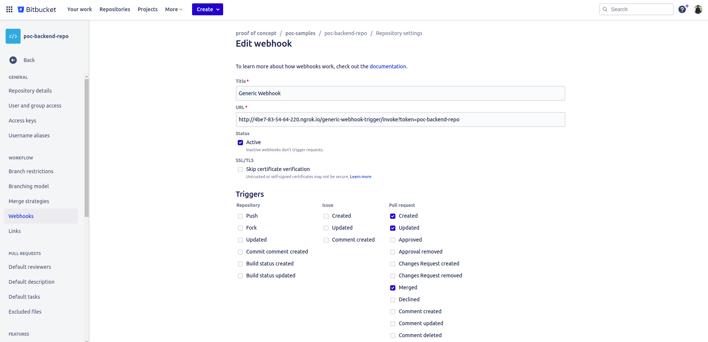

## Description
This is a simple springboot microservice integrated with Jacoco and Bitbucket + Sonarcloud

The Jacoco maven plugin generate the code coverage to be published in SonarCloud.
The build and test steps are automated using the CI/CD service of Jenkins integrated with Bitbucket CVS

## Jacoco integration

We must install jacoco maven plugin and configure it. Also we can create checks to control the coverage and fail if we not achive this level.

```shell
<plugins>
	<plugin>
		<groupId>org.springframework.boot</groupId>
		<artifactId>spring-boot-maven-plugin</artifactId>
	</plugin>
	
	<plugin>
	    <groupId>org.jacoco</groupId>
	    <artifactId>jacoco-maven-plugin</artifactId>
	    <version>${jacoco.version}</version>
	    
	    <configuration>
	        <excludes>
	        	<exclude>io/oferto/pocbackendrepo/**/*DTO.*"</exclude>
	            <exclude>*Test*</exclude>
	        </excludes>
	    </configuration>
	    		    
	    <executions>
	        <execution>
	            <goals>
	                <goal>prepare-agent</goal>
	            </goals>
	        </execution>
	        
	        <execution>
	            <id>report</id>
	            <phase>prepare-package</phase>
	            <goals>
	                <goal>report</goal>
	            </goals>
	        </execution>
	        
	        <execution>
	        	<id>jacoco-check</id>
	        	<goals>
	                <goal>check</goal>
	            </goals>
	            <configuration>
	            	<rules>
	            		<rule>
	            			<element>PACKAGE</element>
	            			<limits>
	            				<limit>
	            					<counter>LINE</counter>
	            					<value>COVEREDRATIO</value>
	            					<minimum>0.3</minimum>
	            				</limit>
	            			</limits>			            			
	            		</rule>
	            	</rules>
	            </configuration>
	        </execution> 
	    </executions>
	</plugin>			
</plugins>
```
		
This capture show locally the jacoco report to be checked from eclipse


## SonarCloud integration

We must create a free account in Sonarcloud and integrate with Bitbucket. The the Organization and Project where we created the repos
will be showed inside SonarCloud waiting for any report to be insert

SonarCloud showing the codecovearge of our microservice


## Jenkins integration

We create a Jenkins service from Docker and installed these plugins:

- **Docker plugin**: To integrate with docker.
- **Docker pipeline**: to user Docker inside our pipelines.
- **Bitbucket plugin**: To Pull repos from Bitbucket in our pipeline.
- **Bitbucket** Build Status Notifier Plugin: Send PR status to Bitbucket.

We must create a Webhook in Bitbucke to send any PR event to jenkins



Finally we will use the generic webhook trigger to have more control under the PR event payload for:

- Execute a prebuild an test of the origin branch when create or update the PR.
- Execute a prebuild, test and docker package only when accept the PR in the destination branch

The pipeline just now is implemented inside jenkins, but the jenkins pipeline could be chedked from Jenkinsfile

This is the pipeline configuration 

Jenkins filters for bitbucket payload body entity


Jenkins filters for bitbucket headers entities


